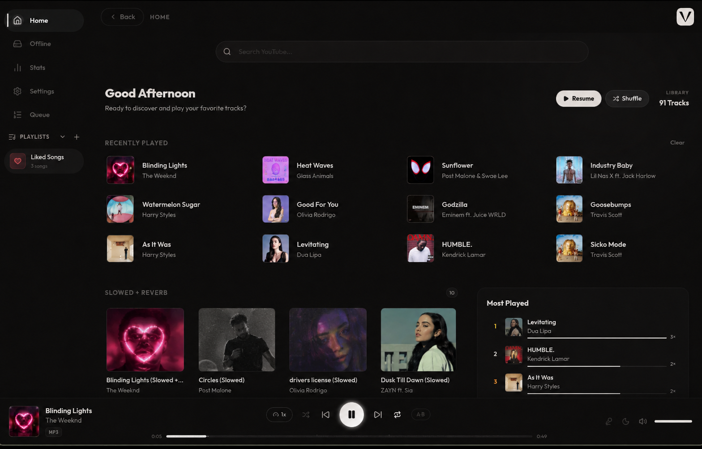
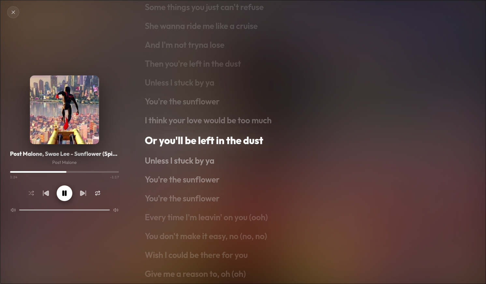

# Veluna

<p align="center">
  
</p>

<h3 align="center">You're paying for music you could be getting for free. Right now.</h3>

<p align="center">
A free, open-source desktop music player for people who are done with ads, subscriptions, and apps that spy on them.<br/>
Stream from YouTube. Download for offline use. Own your library. No account, ever.
</p>

<p align="center">
  <a href="https://github.com/rry0ku/veluna/releases"></a>
</p>

<p align="center">
  <sub>Free forever. Open source. Takes under a minute to install.</sub>
</p>

<p align="center">
  
</p>

<p align="center">
  
</p>

[](https://github.com/rry0ku/veluna/releases)
[](LICENSE)
[](https://tauri.app)
[](https://www.rust-lang.org)
[](https://react.dev)
[](https://github.com/rry0ku/veluna/stargazers)

**[Download](https://github.com/rry0ku/veluna/releases) · [Build from Source](#building-from-source) · [Report a Bug](https://github.com/rry0ku/veluna/issues)**

---

## Ask yourself this

How much did you pay for music software last month? How many ads did you sit through to hear a song you already knew the words to? How much of your listening history does some server somewhere know about, that you never agreed to hand over?

Veluna exists because the answer to all three of those should be zero.

No account required. No telemetry. No ads. No cloud dependency beyond YouTube itself. It streams straight from YouTube through `yt-dlp` and plays it through `mpv`, wrapped in a native Tauri shell built with Rust and React. That means it's fast, it's light on your system, and it runs the same whether you're on Linux or Windows.

You already have everything you need to stop paying for this. It's one download away.

---

## Features

### 🔍 Streaming & Search
- Search YouTube directly from the app, with results split into **dual search categories** (**YT Music** for official audio releases and **Videos** for official music videos)
- Stream audio instantly via `yt-dlp` + `mpv` IPC, no video overhead, no buffering delay
- Search history dropdown (up to 8 recent queries) with one-click re-search
- **Quick Picks**, a strip of your 20 most recently played tracks on the home screen for instant replay
- **Genre Shelves**, the home screen auto-detects genres from your listening history and groups tracks into horizontal scrollable shelves (Hip-Hop, EDM, Pop, Rock, R&B, Lo-Fi, K-Pop, Phonk, and more)
- **Autoplay Recommendations**, automatically discovers and queues similar tracks when your active playlist or queue ends

### 📁 Offline Library
- Point Veluna at any local music folder; it scans recursively and enriches metadata in the background without blocking the UI
- **Local Track Cover Art Support**, dynamically reads embedded metadata covers or cached artwork for local files
- **Waveform Visualisation**, automatic waveform thumbnail generation for local audio tracks
- **Metadata Editor**, edit title, artist, and album tags directly on local files with changes written to disk
- Filter your library in real time, zero latency, pure in-memory search
- Drag-to-reorder tracks, rename or delete files from the UI, show any track in your file manager
- Export and import playlists in standard **M3U format**

### ⬇️ Downloads
- Download any YouTube track with one click from search results, right-click menu, or the download button beside the heart icon
- Choose your **audio format**: MP3, Opus, M4A, or FLAC
- Choose your **quality**: High (320kbps+), Medium (~128kbps), or Low
- **Embed Thumbnail**, cover art written directly into file metadata tags, alongside title, artist, and album
- **Duplicate Detection**, scans your download folder first and skips tracks you already have

### 🎵 Playlists
- Create, name, and describe playlists; edit or delete at any time; upload a custom cover image
- **Enhanced View Selector**, switch between grid and list views with smooth interactive scaling
- **Collapsible Sidebar Playlists** with glowing active accents and track count subtitles
- **Search within a playlist**, filter tracks by title or artist in real time
- **Liked Songs**, a built-in smart playlist. Heart any track anywhere in the app to add it
- **Import from Spotify**, export your Spotify playlist as a CSV via [exportify.net](https://exportify.net), upload it, and Veluna matches each track against YouTube with a live progress feed
- **Import from YouTube**, paste any public YouTube or YouTube Music playlist link for instant import with automatic title extraction and high-definition cover art

### 📋 Queue
- Add any track to the persistent queue from search results, playlists, or right-click menus
- Drag-to-reorder the queue at any time. Queue survives across sessions

### ▶️ Playback Engine
- **mpv backend** via IPC socket (Unix) / named pipe (Windows), full codec support, hardware decoding
- **Shuffle**, **Repeat** (Off / All / One), **Playback speed** (0.5x-2x)
- **Volume control** via slider, scroll wheel, or mute with memory
- **Seek bar** with waveform visualisation overlay on local files
- **A-B Loop**, loop any segment continuously until cleared
- **Bookmarks**, save one position per track, restored on next play
- **Continue Where Left Off**, saves position every 5 seconds per track
- **Next-track prefetching** for gapless transitions
- **EBU R128 Loudness Normalisation** and **Skip Silence** filters
- **3-Band Equalizer**, real-time bass, mid, and treble adjustment applied live

### 🎤 Lyrics
- Synced lyrics with **real-time line highlighting** that scrolls automatically as the song plays, click any line to seek
- **Immersive full-screen view**, blurred album art background, progress bar, controls, and scrolling lyrics side by side
- **Lyrics Source** selector: choose between **lrclib**, **Musixmatch**, or **NetEase**, with automatic fallback if your primary source fails

### 🎮 Discord Rich Presence
- Shows current playing track, artist, elapsed/remaining time, and album art on your Discord profile
- Interactive buttons for "Listen on YouTube" and "Download Veluna"

### 🖥️ System Tray *(optional)*
- Left-click to show/hide the window; tray menu with Play/Pause, Next, Previous, Show, Quit
- Closing the window hides to tray instead of exiting

### ⌨️ Controls & Shortcuts

| Action | Shortcut |
|--------|----------|
| Play / Pause | `Space` |
| Seek forward 10s | `→` |
| Seek backward 10s | `←` |
| Mute / Unmute | `M` |
| Focus search bar | `Ctrl+F` |
| Play / Pause (media key) | Hardware key |
| Next track (media key) | Hardware key |
| Previous track (media key) | Hardware key |

Media keys are registered globally and work even when the app is not in focus.

### 🐧 MPRIS2 Integration (Linux)
Veluna registers a full `org.mpris.MediaPlayer2.veluna` D-Bus service. Works with **playerctl**, **KDE Connect**, **GNOME Shell extensions**, and any MPRIS2-compatible widget.

### 📊 Stats
A personal listening analytics dashboard with **All Time** and **Last 7 Days** filtering:
- **Core Metrics**: Time Listened, total Tracks Played, Unique Tracks
- **Activity Chart**, interactive daily play activity over the last 30 or 7 days
- **Behavioral Insights**: Favorite Time, Unique Artists, Loyalty Index
- **Top Rankings**: Top Tracks, Top Artists, Top Genres

### 🌙 Sleep Timer
Preset buttons (5-90 min) or custom input. Live countdown in sidebar. Cancellable any time.

### 🖱️ Right-Click Context Menus
Available on every track: Play, Add to Queue, Add to Playlist, Download, Edit Metadata, Copy URL, Copy Title, Open in YouTube, Track Info.

### ⚙️ Settings
- **Downloads**: audio quality, format, destination folder, embed thumbnail, duplicate detection
- **Playback**: loudness normalization, skip silence, autoplay recommendations, 3-band equalizer
- **Integrations**: Discord Rich Presence, primary lyrics source
- **Appearance**: 8 built-in themes, custom accent and background color, default startup page, tray toggle
- **Storage**: backup location, create/restore backup, reset app data
- **Updates**: automatic update check against GitHub Releases

### 💾 Backup & Restore
Export all playlists, queue, play history, EQ settings, search history, and preferences as a single JSON file. Restore or reset any time.

---

## Installation

### Linux, Arch / Manjaro / EndeavourOS

Build and install the native Arch Linux `.pkg.tar.zst` package with `makepkg`:

```bash
git clone https://github.com/rry0ku/veluna.git
cd veluna/packaging
makepkg -si
```

### Linux, Debian / Ubuntu / Mint

```bash
sudo apt install ./veluna_<version>_amd64.deb
```

`apt` resolves and installs all required system dependencies automatically: `mpv`, `yt-dlp`, `ffmpeg`, `ffprobe`.

> For system tray support on GNOME, install `libayatana-appindicator3-1`.

Launch from your application menu or run:

```bash
veluna
```

### Linux, Fedora / RedHat

```bash
sudo dnf install ./veluna_<version>_x86_64.rpm
```

`dnf` resolves and installs all required system dependencies automatically.

> For system tray support on GNOME, install `libayatana-appindicator-gtk3`.

Launch from your application menu or run:

```bash
veluna
```

### Windows

Download and run the `veluna_<version>_x64-setup.exe` installer from the [Releases](https://github.com/rry0ku/veluna/releases) page. The installer automatically bundles all required audio binaries (`mpv`, `yt-dlp`, `ffmpeg`, `ffprobe`) into the installation directory. No manual setup, package managers, or extra tools required.

---

## Building from Source

### Prerequisites

| Requirement | Version | Notes |
|---|---|---|
| [Node.js](https://nodejs.org/) | 18+ | Frontend build & Tauri CLI (`npm`) |
| [Rust](https://rustup.rs/) | stable | `rustup install stable` |

### Linux, System Dependencies

For Arch Linux (Pacman):
```bash
sudo pacman -S --needed mpv yt-dlp ffmpeg openssl pkg-config \
  webkit2gtk-4.1 gtk3 cairo gdk-pixbuf2 glib2 \
  libayatana-appindicator librsvg
```

For Debian/Ubuntu/Mint (APT):
```bash
sudo apt install mpv yt-dlp ffmpeg libssl-dev pkg-config \
  libwebkit2gtk-4.1-dev libgtk-3-dev \
  libayatana-appindicator3-dev librsvg2-dev
```

For Fedora/RedHat (DNF):
```bash
sudo dnf install -y mpv yt-dlp ffmpeg openssl-devel pkg-config \
  webkit2gtk4.1-devel gtk3-devel glib2-devel \
  librsvg2-devel libayatana-appindicator-gtk3-devel
```

### Windows, Bundled Binaries

Run the automated setup script to download and configure all dependencies:

```bash
npm run setup:deps
```

*(Alternatively, download `binaries.zip` from the [Releases](https://github.com/rry0ku/veluna/releases) page and extract directly into `src-tauri/binaries/`).*

### Clone & Build

```bash
git clone https://github.com/rry0ku/veluna.git
cd veluna
npm install
npm run tauri build
```

| Platform | Output path |
|---|---|
| Linux `.deb` | `src-tauri/target/release/bundle/deb/` |
| Linux `.rpm` | `src-tauri/target/release/bundle/rpm/` |
| Windows `.exe` | `src-tauri/target/release/bundle/nsis/` |

### Development Mode

```bash
npm run tauri dev
```

---

## How It Works

### Audio Pipeline

```
YouTube URL
    │
    ▼
yt-dlp (audio extraction, stdout pipe)
    │
    ▼
mpv (IPC-controlled via Unix socket / Windows named pipe)
    │
    ▼
System audio output (PipeWire / PulseAudio / DirectSound / WASAPI)
```

### Lyrics Pipeline

```
Track title + artist
    │
    ▼
Parallel fetch: primary source (lrclib / Musixmatch / NetEase) + fallbacks
    │
    ▼
LRC timestamps parsed → line-by-line sync against mpv progress
    │
    ▼
Immersive full-screen view with auto-scroll + seek-on-click
```

### Spotify Import Flow

```
User exports CSV from exportify.net
    │
    ▼
Veluna parses CSV → extracts title + artist pairs
    │
    ▼
Up to 12 concurrent yt-dlp searches run in parallel
    │
    ▼
Each match/failure updates the live progress list
    │
    ▼ (even if window was minimized)
Name & description popup appears when matching completes
    │
    ▼
Playlist saved to localStorage
```

---

## Tech Stack

| Layer | Technology | Purpose |
|---|---|---|
| UI Framework | React 19 + TypeScript | Component rendering, state management |
| Styling | Vanilla CSS | Custom design system, dynamic gradients, ambient blurs |
| Icons | lucide-react | All UI icons |
| Desktop Shell | Tauri v2 | Native window, IPC bridge, file system |
| Backend | Rust (stable) | All system operations |
| Audio Engine | mpv | Decoding and playback via IPC |
| Streaming / Download | yt-dlp | YouTube search, streaming, downloading |
| Media Info | ffprobe / ffmpeg | Metadata, waveform generation, format conversion |
| Discord RPC | discord-rich-presence | Live Discord status & interactive buttons |
| MPRIS2 | zbus 3 | D-Bus integration on Linux |
| Global Shortcuts | tauri-plugin-global-shortcut | Hardware media key support |
| File Dialogs | tauri-plugin-dialog | Folder/file pickers |
| URL Opening | tauri-plugin-opener | Opening links in system browser |
| HTTP | reqwest | Lyrics fetching, GitHub update check |

---

## Project Structure

```
veluna/
├── .github/
│   └── workflows/
│       ├── ci.yml                # Automated CI checks (Linux & Windows)
│       └── release.yml           # Automated release packaging (.deb, .rpm, .exe)
├── scripts/
│   └── setup-deps.js             # Automated cross-platform Windows binaries setup
├── src/
│   ├── App.tsx                   # React UI main entry & core state
│   ├── App.css                   # Core design system & component styles
│   ├── constants.ts              # App constants and defaults
│   ├── types.ts                  # Shared TypeScript type definitions
│   ├── utils.ts                  # Common helper utilities & validators
│   └── components/               # Modular UI sub-components
│       ├── DownloadsPanel.tsx    # Offline library & folder downloads panel
│       ├── Modals.tsx            # Consolidated modal overlays & dialogues
│       ├── SettingsPanel.tsx     # Full app settings panel interface
│       ├── SleepTimerPopover.tsx # Sleep timer popover overlay
│       ├── SpeedSelector.tsx     # Playback rate controller popover
│       ├── ThemedSelect.tsx      # Custom styled dropdown select
│       ├── TrackRow.tsx          # Track list item renderer with context menus
│       ├── VirtualTrackList.tsx  # Virtualized list for large collections
│       └── WaveformBar.tsx       # Audio waveform progress bar
├── src-tauri/
│   ├── src/
│   │   ├── main.rs               # Rust backend, MPV IPC observer & command handlers
│   │   └── tray.rs               # System tray (Linux + Windows)
│   ├── build.rs
│   ├── Cargo.toml
│   ├── tauri.conf.json           # Main Tauri configuration & Linux packaging
│   ├── tauri.windows.conf.json   # Windows sidecar binary bundling config
│   ├── icons/
│   ├── packaging/                # Linux post-install scripts
│   └── binaries/                 # Windows bundled executables
├── docs/                         # Landing page & installer script
├── packaging/                    # Linux packaging resources
├── screenshots/                  # Preview screenshots
│   ├── ss1.png                   # Home dashboard & discovery
│   └── ss2.png                   # Immersive full-screen synced lyrics
├── public/
├── index.html
├── package.json
└── vite.config.ts
```

---

## Data & Privacy

All application state is stored locally in the webview's `localStorage` under `vg_*` prefixed keys. No database, no cloud sync, no external server. The only network requests Veluna makes:

| Request | When | Purpose |
|---|---|---|
| YouTube search / stream | When you search or play | Via yt-dlp |
| YouTube thumbnail images | When displaying track art | Direct img src |
| lrclib / Musixmatch / NetEase | When lyrics are opened | Synced lyrics fetch |
| GitHub Releases API | Once on startup | Update check |

No usage data, crash reports, or analytics are ever collected or transmitted. That's not a policy that could change one day. There's simply no code path that sends it anywhere.

---

## Contributing

Pull requests are welcome. For major changes, please open an issue first.

```bash
git clone https://github.com/rry0ku/veluna.git
cd veluna
npm install
npm run tauri dev
```

---

## License

MIT © [rry0ku](https://github.com/rry0ku)

---

*Built with Rust, React, and a stubborn belief that music software shouldn't interrupt your listening with ads.*
